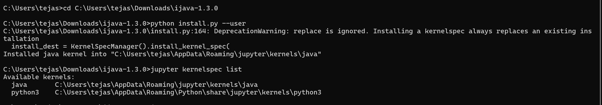

# Java in Jupyter

Run **Java** code directly inside **Jupyter Notebooks** using the **IJava** kernel.
Perfect for interactive learning, demos, assignments, and sharing runnable Java notes.

>  Works on Windows, macOS, and Linux
>  Uses JShell under the hood (so you can run snippets, not just full classes)

---

## Table of Contents

* [Why Java in Jupyter?](#why-java-in-jupyter)
* [Prerequisites](#prerequisites)
* [Quick Start](#quick-start)
* [Install the IJava Kernel](#install-the-ijava-kernel)
  * [Option A: Prebuilt installer (recommended)](#option-a-prebuilt-installer-recommended)
* [Verify the Kernel](#verify-the-kernel)
* [Run Your First Notebook](#run-your-first-notebook)
* [Example Notebooks](#example-notebooks)
* [Screenshots](#screenshots)
* [Troubleshooting](#troubleshooting)


---

## Why Java in Jupyter?

* **Interactive**: execute code cell-by-cell with instant output.
* **Great for learning**: mix explanations, code, and output in one place.
* **Shareable**: push notebooks to GitHub for others to run and learn from.

---

## Prerequisites

Make sure you have:

1. **Java JDK 8+** (JDK 17 recommended)

```bash
java -version
javac -version
```

2. **Python + Jupyter Notebook**

```bash
pip install notebook
```

> On Windows, you can use **Command Prompt** or **PowerShell** for the commands.

---

## Quick Start

1. Install the IJava kernel (see next section).
2. Launch Jupyter:

```bash
jupyter notebook
```

3. From **New → Java**, create a notebook and run:

```java
System.out.println("Hello from Java in Jupyter!");
```

---

## Install the IJava Kernel

### Option A: Prebuilt installer (recommended)

1. Download the latest release ZIP from the IJava releases page (e.g. `ijava-1.x.x.zip`).
2. **Unzip** it (e.g. to `Downloads/ijava-1.x.x`).
3. In a terminal, run:

   ```bash
   cd <path-to-unzipped-ijava>
   python install.py --user
   ```

   On success you’ll see something like:

   ```
   Installed java kernel into "C:\Users\<you>\AppData\Roaming\jupyter\kernels\java"
   ```

> Windows tip: Right-click the ZIP → **Extract All…**. Then open **cmd** and `cd` into that folder.


---

## Verify the Kernel

```bash
jupyter kernelspec list
```

You should see:

```
Available kernels:
  java      .../jupyter/kernels/java
  python3   .../jupyter/kernels/python3
```

---

## Run Your First Notebook

1. Start Jupyter:

```bash
jupyter notebook
```

2. **New → Java** (or **Kernel → Change kernel → Java** in an open notebook).
3. Try these cells:

**Hello World**

```java
System.out.println("Hello, Jupyter + Java 🚀");
```

**Variables**

```java
int age = 20;
double pi = 3.14159;
String name = "Tejaswini";
System.out.println(name + " | " + age + " | " + pi);
```

**Loop**

```java
for (int i = 1; i <= 5; i++) {
    System.out.println("Count: " + i);
}
```

**Class + Method**

```java
class Calculator {
    public int add(int a, int b) { return a + b; }
}
Calculator c = new Calculator();
System.out.println(c.add(5, 10));
```

---

## Example Notebooks

All example notebooks live in the **`notebooks/`** folder:

* [HelloWorld.ipynb](notebooks/HelloWorld.ipynb) — first Java snippet
* [Arithmetic.ipynb](notebooks/Arithmetic.ipynb) — basic math operations
* [Loops.ipynb](notebooks/Loops.ipynb) — `for` and `while` loops
* [Class\_Example.ipynb](notebooks/Class_Example.ipynb) — defining & using a class


---

### Screenshots

**Selecting Java Kernel**  


**Running Hello World**  


**Install output (optional)**  


---

## Troubleshooting

**Java kernel not showing in Jupyter**

* Re-run the installer:

  ```bash
  python <path-to-ijava>/install.py --user
  ```
* Then:

  ```bash
  jupyter kernelspec list
  ```
* Restart Jupyter Notebook after installation.

**Multiple Pythons / environments**

* If you have multiple Python installs, use the same one that runs Jupyter:

  ```bash
  python -m pip install notebook
  python <path-to-ijava>/install.py --sys-prefix
  ```

**Uninstall / reinstall the kernel**

```bash
jupyter kernelspec remove java
# then reinstall using install.py --user or --sys-prefix
```

**Confirm JShell exists (JDK install)**

```bash
java --list-modules | grep jdk.jshell   # macOS/Linux
# or on Windows PowerShell:
java --list-modules | findstr jdk.jshell
```

---
